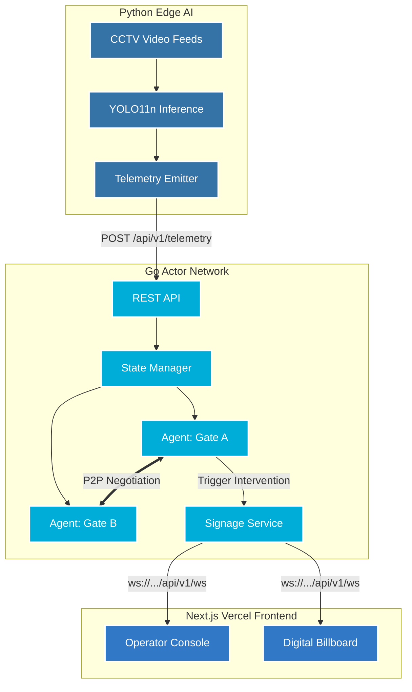

# 🚨 Crowd Flow Optimiser

> **An autonomous, multi-agent computer vision platform engineered to prevent catastrophic crowd crush and spatial bottlenecks in real-time.**

Crowd Flow Optimiser is not just a dashboard; it is a **safety-critical autonomous system**. It fuses edge-based computer vision (YOLO11) with a highly concurrent, actor-model Go backend to mathematically evaluate venue density, negotiate load-shedding between physical zones, and actuate dynamic digital signage to physically redirect crowds before a bottleneck becomes a disaster.

---

## 🏗️ System Architecture

The system is designed around a strictly decoupled, highly fault-tolerant pipeline. The "hot path" remains strictly deterministic, while generative AI is used asynchronously on the edge to optimize communication without risking system latency.



---

## 🧠 The Multi-Model Strategy

To achieve human-level spatial management without compromising deterministic safety, CFO employs a tiered multi-model architecture:

1. **Spatial Perception (YOLO11n):** Runs in the Python telemetry layer. Its sole responsibility is processing video frames to extract structural density vectors (Occupancy vs. Capacity).
2. **Predictive Extrapolation (Go Statistics):** The backend tracks `inflow_rate` and `outflow_rate` per zone. A fast, linear extrapolation identifies if a zone will reach critical mass in the next 5 minutes, allowing preemptive action without the overhead of heavy time-series inference.
3. **Asynchronous Generative Polish (LLM):** Large Language Models (like Gemini/GPT-4o) are kept strictly *out* of the safety-critical hot path. When the Go engine makes a deterministic decision to reroute a crowd, it immediately acts using hardcoded fallbacks. Simultaneously, it asynchronously polls an LLM to dynamically rewrite the digital signage message to be calmer and more contextual.

---

## ⚡ Key Features

*   **P2P Agent Negotiation:** Zones are modeled as independent Go routines. They do not rely on a central loop. When `Gate A` gets overwhelmed, it opens a negotiation channel with `Gate B` to ask: *"I have 50 extra people, can you absorb them?"*
*   **Deterministic Fail-Safes:** If an API times out or a connection drops, the system defaults to safe, hardcoded interventions instantly.
*   **Real-time Actuation:** The platform ships with a `/signage` Digital Billboard route. The instant the Go backend issues a reroute, the digital signage across the physical venue updates over WebSocket.
*   **Zero-Latency Telemetry:** Built with `asyncio` and thread-pooling, the Python telemetry layer can push 30FPS inference data directly to the Go backend without event-loop starvation.

---

## 🚀 Deployment

The entire platform is fully containerized and deployable to the cloud.

### Infrastructure Map
*   **Frontend (Next.js):** Deployed serverlessly via Vercel.
*   **Backend (Go):** Deployed as a web service via Render (Docker).
*   **Telemetry (Python):** Deployed as a web service via Render (Docker).

### Environment Variables
For the system to correctly wire itself in production, ensure the Vercel frontend is supplied with:
```env
NEXT_PUBLIC_API_URL=https://<your-go-backend-url>
NEXT_PUBLIC_AI_URL=https://<your-python-telemetry-url>
NEXT_PUBLIC_TELEMETRY_WS_URL=wss://<your-python-telemetry-url>
```

---

## 🛡️ Security & Quality Guarantees

This repository enforces strict engineering hygiene:
*   **No Sprawling Feature Branches:** All development is strictly integrated into a single stable `main` branch to prevent deployment regressions.
*   **Isolated Websocket Layers:** The frontend UI subscribes to an internal `/api/v1/ws` read-only stream. It cannot inject false telemetry into the backend.
*   **Opt-in LLM Layer:** The generative capabilities of the digital signage are designed via an interface (`Generator`). The system runs perfectly with the default `NoopGenerator` if LLM keys are absent.

Please refer to `SECURITY.md` for vulnerability reporting protocols.
