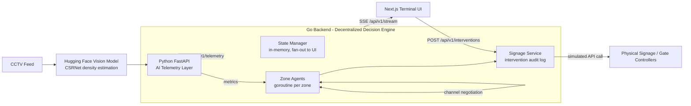

# CROWD_FLOW // OPTIMISER

**Decentralized, multi-agent crowd management. CCTV in. Physical intervention out.**

> **Repository Status:** Hackathon prototype. Production-grade architecture, simulated actuators.

---

## 0. The Hook

**Monitoring a dashboard doesn't save lives. Executing automated interventions does.**

Every crowd-safety hackathon delivers the same thing: a pretty map with red
blobs and a pulse. Congratulations, you have built an expensive mirror. You
can *watch* a bottleneck form on a screen and still watch people get crushed,
because **nobody closed the loop**.

This is not that. This is a network of autonomous zone agents that **talk to
each other**, make load-balancing decisions in microseconds, and drive
physical signage — without a human staring at a monitor.

If you are here to render particles, leave. If you are here to build the
**action layer** that keeps people moving, keep reading.

---

## 1. The Pain Point — the "Last Mile" Action Gap

Detection is cheap. Action is the hard problem.

1. **Detecting a bottleneck is ~10% of the problem.** Vision models have been
   counting people for a decade. A density number is not a decision, it is a
   raw material.
2. **Human behaviour is irrational.** People follow signs, herd, panic, and
   ignore common sense. You cannot *predict* your way out of that — you have
   to *intervene* your way out of it, in real time.
3. **Centralized monolithic simulations break under real-world latency.**
   One central engine simulating every zone, every agent, every pedestrian is
   a single point of failure with O(n) complexity that degrades exactly when
   you need it most: at peak load. Your "real-time simulation" becomes a
   slow-motion replay of yesterday.

The gap between "we know where it's crowded" and "we changed where people go"
is where people get hurt. That gap is the **last mile**. This project is a
bridge across it.

---

## 2. Our Solution — Decentralized Agent Architecture

We treat the venue as a **dynamic network of autonomous zone agents**, not as
one big simulation.

Each zone — `GATE_A`, `CONCOURSE_A`, `SECURITY_T1` — is an independent
decision-maker running on its own goroutine. Agents hold **no global
simulation state**. They hold local facts and a peer registry, and they
negotiate with their neighbours directly, message-passing style.

> `GATE_A` does not wait for a central server to figure out that it is
> overflowing and tell it what to do. `GATE_A` reads its own density, computes
> its overflow, and **offers** that overflow to the least-loaded gate it can
> reach. `GATE_B` accepts or rejects based on its own spare capacity — the
> same way a real network load-balances.

This is not a metaphor for load balancing. It **is** load balancing, applied
to physical infrastructure. The result:

- **No central bottleneck.** There is nothing to saturate, because there is
  no single simulation to saturate.
- **Peer-to-peer latency.** Negotiation is two goroutines and a channel. It
  happens in microseconds, not in a simulation loop.
- **Graceful degradation.** An overloaded zone drops samples, it never
  stalls the pipeline.
- **Provable execution.** Every accepted negotiation becomes a *physical
  intervention* — a signage change, a gate hold, a staff dispatch — recorded
  in an audit log as if it hit a signage controller API.

---

## 3. System Architecture



**Runtime data flow:** CCTV frames → HF density model → Python telemetry
fusion → Go agent network (facts to State Manager, samples to agents) →
peer-to-peer negotiation → signage intervention → SSE fan-out to the UI.

---

## 4. Repository Layout

```
crowd-flow-optimiser/
├── backend/              Go — decentralized zone-agent network & state manager
│   ├── cmd/server/       entrypoint: wires agents, state, HTTP/SSE
│   └── internal/
│       ├── agent/        Node + Network — goroutine-per-zone, channel negotiation
│       ├── state/        thread-safe telemetry store + SSE fan-out
│       ├── intervention/ signage API seam + intervention audit log
│       ├── api/          REST + SSE handlers
│       ├── models/       shared types
│       └── config/       environment-driven config
│
├── ai-telemetry/         Python/FastAPI — Hugging Face vision model integration
│   └── app/
│       ├── services/density.py     HF model seam (simulated ↔ live)
│       ├── services/simulator.py   synthetic CCTV pipeline → backend push
│       └── core/config.py          topology + tuning knobs
│
├── frontend/             Next.js + Tailwind — stark financial-terminal UI
│   ├── app/              App Router pages
│   ├── components/       ZoneCard, TopBar, InterventionLog
│   └── lib/              API client + EventSource live stream
│
├── docs/                 architecture.md, api-spec.md
├── docker-compose.yml    one-command full-stack bring-up
├── .env.example          configuration reference
└── README.md
```

---

## 5. Tech Stack Justification

### Go — the decision engine

Go's concurrency model **is** our architecture. A zone agent is literally a
goroutine; a negotiation is literally a channel handshake. The standard
library gives us a production HTTP server, and our fan-out (SSE) needs zero
external dependencies.

- **Goroutines:** ~2 KB stack, tens of thousands of agents per node. Each
  zone is a first-class citizen, not a struct in a loop.
- **Channels:** message-passing semantics — no locks in the hot path, no
  shared mutable simulation state to corrupt.
- **Decoupled ingest vs decision:** telemetry writes are synchronous and
  cheap (facts); decisions are asynchronous and isolated (agents). A hot zone
  never blocks a cold one.
- **Dependency-light:** the entire backend is stdlib-only except one
  dependency — `gorilla/websocket` for the terminal's live stream. Buildable
  anywhere, auditable in an afternoon.

### Python / FastAPI — the vision seam

Python owns the ML ecosystem. Hugging Face Hub hosts crowd-density models
(CSRNet-style counting). FastAPI gives async HTTP ingest and a free OpenAPI
contract. This is the *sensing* layer and it should not know or care about
the *acting* layer — it just normalises model outputs into the telemetry
contract.

### Next.js + Tailwind — the terminal

A crowd-control operator should feel like a market trader, not a gamer. The
UI is stark, monospaced, dark, and data-dense: zone occupancy, live density,
and a scrolling intervention log streamed over Server-Sent Events. It shows
**decisions and actions**, not particles.

---

## 6. Quick Start

### Option A — Docker Compose (recommended)

```bash
docker compose up --build
```

| Service | URL |
| --- | --- |
| Terminal UI | http://localhost:3000 |
| Go agent network | http://localhost:8080 |
| AI telemetry + OpenAPI docs | http://localhost:8000/docs |

You should see the synthetic CCTV pipeline pushing telemetry immediately, and
within ~30 seconds the scripted surge will push `GATE_A` critical — watch
the intervention log light up as it negotiates with its neighbours and flips
signage.

### Option B — Local dev (three terminals)

```bash
# 1. AI telemetry layer (Python 3.11+, or use a venv)
cd ai-telemetry
pip install -r requirements.txt
AI_EMIT_TO_BACKEND=http://localhost:8080/api/v1/telemetry \
  uvicorn app.main:app --port 8000

# 2. Go agent network (Go 1.22+)
cd backend
go run ./cmd/server

# 2b. Minimal two-gate negotiation demo (raw channels, no HTTP)
cd backend
go run .

# 3. Terminal UI (Node 20+)
cd frontend
npm install
npm run dev
```

```bash
# sanity-check the backend
curl -s http://localhost:8080/api/v1/zones | jq '.zones[0]'
# force a physical intervention from the CLI
curl -s -X POST http://localhost:8080/api/v1/interventions \
  -H 'Content-Type: application/json' \
  -d '{"zone_id":"GATE_A","type":"SIGNAGE_REROUTE","message":"manual override"}'
```

---

## 7. Configuration

All knobs are environment variables — see `.env.example` and
[`docs/api-spec.md`](docs/api-spec.md). Highlights:

| Env var | Default | Purpose |
| --- | --- | --- |
| `BACKEND_ZONE_TOPOLOGY` | 9-zone list | Venue graph; adjacency derived from order |
| `AI_MODE` | `simulated` | `simulated` (no GPU/token) or `live` (real HF inference) |
| `AI_HF_MODEL_ID` | `csrnet-pytorch` | Hugging Face density model |
| `AI_SIM_LOOP_INTERVAL_SECONDS` | `2` | Telemetry emit cadence |
| `NEXT_PUBLIC_API_URL` | `http://localhost:8080` | Backend base URL for the UI |

---

## 8. What the Demo Shows

1. **Live telemetry fusion** — synthetic CCTV frames pushed through the
   vision seam into per-zone density metrics every ~2s.
2. **Decentralized negotiation** — a scripted surge drives `GATE_A` past
   capacity; it *offers* its overflow to the least-loaded neighbour, and the
   signage changes are logged.
3. **The last mile closed** — every critical event results in a recorded,
   simulated physical intervention. No human needed. No dashboard stare.
4. **Manual override** — operators can force signage from the UI or CLI.

---

## 9. Production Path

This prototype intentionally leaves a clean seam at every boundary:

- **Vision:** `DensityEstimator` swaps simulated for live HF inference — the
  contract is identical. Real CCTV frames replace the simulator.
- **Actuation:** `intervention.Client` is one interface. Point it at a real
  signage controller / gate system instead of the log-only client.
- **Scale:** agents are already independent — run them as separate processes
  behind NATS, with the peer registry becoming a service mesh.
- **State:** swap the in-memory manager for a stream (Redis / Kafka) for
  multi-replica durability.

---

### License

MIT. Build something that keeps people moving.
