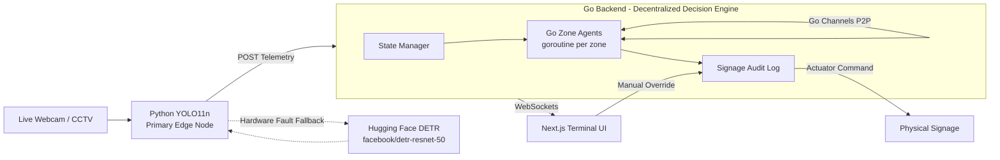

# CROWD_FLOW // OPTIMISER

**Decentralized, multi-agent crowd management. CCTV in. Physical intervention out.**

> **Repository Status:** Hackathon prototype. Production-grade architecture, live webcam telemetry + simulated actuators.

---

## 0. The Hook

**Monitoring a dashboard doesn't save lives. Executing automated interventions does.**

Every crowd-safety hackathon delivers the same thing: a pretty map with red blobs and a pulse. Congratulations, you have built an expensive mirror. You can *watch* a bottleneck form on a screen and still watch people get crushed, because **nobody closed the loop**.

This is not that. This is a network of autonomous zone agents that **talk to each other**, make load-balancing decisions in microseconds, and drive physical signage — without a human staring at a monitor.

If you are here to render particles, leave. If you are here to build the **action layer** that keeps people moving, keep reading.

---

## 1. The Pain Point — the "Last Mile" Action Gap

Detection is cheap. Action is the hard problem.

1. **Detecting a bottleneck is ~10% of the problem.** Vision models have been counting people for a decade. A density number is not a decision, it is a raw material.
2. **Human behaviour is irrational.** People follow signs, herd, panic, and ignore common sense. You cannot *predict* your way out of that — you have to *intervene* your way out of it, in real time.
3. **Centralized monolithic simulations break under real-world latency.** One central engine simulating every zone degrades exactly when you need it most.

The gap between "we know where it's crowded" and "we changed where people go" is where people get hurt. That gap is the **last mile**. This project is a bridge across it.

---

## 2. Our Solution — Decentralized Agent Architecture

We treat the venue as a **dynamic network of autonomous zone agents**, not as one big simulation.

Each zone is an independent decision-maker running on its own goroutine. Agents hold **no global simulation state**. They hold local facts and negotiate with their neighbours directly via channels.

> `GATE_A` reads its own density, computes its overflow, and **offers** that overflow to the least-loaded gate it can reach. `GATE_B` accepts or rejects based on its own spare capacity — the same way a real network load-balances.

- **No central bottleneck.** Nothing to saturate.
- **Peer-to-peer latency.** Negotiation is two goroutines and a channel (microseconds).
- **Graceful degradation.** Overloaded zones drop samples, they never stall the pipeline.
- **Provable execution.** Every accepted negotiation becomes a *physical intervention* logged in the system.

---

## 3. High-Availability Vision Node

At the very edge, our telemetry pipeline is engineered for absolute resilience. The Python AI node runs a primary **YOLO11n ultra-low-latency loop** capturing live webcam feed at 30+ FPS, instantly tracking optical flow vectors and precise density grids. 

However, edge hardware can panic. If the primary accelerator drops or the local YOLO pipeline crashes, the vision node implements a **dynamic, fault-tolerant fallback** that seamlessly routes frames to Hugging Face's `facebook/detr-resnet-50` via their Inference API. This dual-pipeline architecture guarantees zero-downtime density tracking — we never lose sight of the crowd.

---

## 4. System Architecture



**Runtime data flow:** CCTV frames → YOLO11n (or HF fallback) → Python telemetry fusion → Go agent network → peer-to-peer channel negotiation → signage intervention → WebSockets fan-out to the UI.

---

## 5. Quickstart

### Option A — Docker Compose (Recommended)

Bring up the entire stack (Next.js UI, Go Agents, Python Vision) with a single command:

```bash
docker-compose up --build
```

| Service | URL |
| --- | --- |
| Terminal UI | http://localhost:3000 |
| Go Agent Network | http://localhost:8080 |
| AI Telemetry | http://localhost:8000/docs |

You can immediately open the UI, select `[ WEBCAM (LIVE) ]`, and watch the system track your live density, negotiate overflows, and generate physical reroute interventions in real time!

### Option B — Local dev (three terminals)

```bash
# 1. AI telemetry layer
cd ai-telemetry
python -m venv .venv && source .venv/bin/activate
pip install -r requirements.txt
uvicorn app.main:app --port 8000

# 2. Go agent network
cd backend
go run ./cmd/server

# 3. Terminal UI
cd frontend
npm install
npm run dev
```

---

## 6. License

MIT. Build something that keeps people moving.
