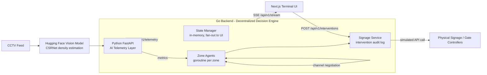

# Architecture

> The venue is not a simulation. It is a graph of autonomous zones that
> negotiate with each other directly. No central sim, no master decision loop.

## System flow



## Data flow (ingest to action)

1. CCTV frames are pushed through a HF vision model (CSRNet-style crowd
   counting). The prototype ships with a **simulated** vision seam.
2. The Python telemetry layer fuses density estimates into per-zone metrics
   (`occupancy`, `density`, `congestion`, flow rates) and bulk-POSTs them to
   the Go backend every tick.
3. Go treats each zone as an **autonomous agent goroutine**. Ingest and
   decision are decoupled:
   - The **State Manager** records facts instantly (UI truth).
   - The **agent's inbox** receives the same sample for decision-making,
     non-blocking (drop rather than stall).
4. A CRITICAL agent computes its overflow and **negotiates directly** with the
   least-loaded neighbour over a channel handshake (`NegotiationOffer` /
   `NegotiationResponse`). This is the load-balancing action that bypasses any
   central bottleneck.
5. Accepted negotiations translate into **physical interventions**
   (`SIGNAGE_REROUTE`, `DYNAMIC_SHUTTLE`, `HOLD_INFLOW`, `DISPATCH_STAFF`)
   via the signage service, which simulates the signage controller API and
   keeps an audit log. When walking-distance neighbours reject an overflow,
   a CRITICAL agent escalates to a **dynamic shuttle** bound for the furthest
   zone with genuine spare capacity; inflow is only held when nowhere can
   absorb the load.
6. Every state change is fan-out to the frontend over Server-Sent Events.
   The operator can also force interventions from the UI.

## Key design decisions

| Decision | Rationale |
| --- | --- |
| Goroutine per zone | N independent decision-makers with near-zero scheduling cost. |
| Channels for negotiation | Message-passing semantics: no locks in the hot path. |
| State Manager vs agents split | Facts are cheap and synchronous; decisions are expensive and asynchronous. |
| WebSocket for live UI, SSE fallback | Two-way liveness + reconnect for the terminal; SSE kept as a stdlib-only fallback. |
| Simulated signage API | The prototype executes "physical" actions without hardware; the seam is one interface. |
| Simulated vision mode | The full pipeline runs with zero CCTV, zero HF tokens, zero GPU. |

## Scaling story

- **Zones** — add a zone to `BACKEND_ZONE_TOPOLOGY`; a goroutine + channel
  appear. In production, topology comes from a spatial graph builder.
- **Backend replicas** — negotiation crosses process boundaries; the peer
  registry becomes a service mesh / broker (NATS). State becomes a stream
  (Redis / Kafka).
- **Throughput** — the ingest path is non-blocking by design; agents degrade
  by dropping samples under saturation instead of backing up.

## Directory map

```
backend/              Go — agent network, state, signage, HTTP/SSE
  cmd/server/         entrypoint
  internal/agent/     Node + Network (negotiation over channels)
  internal/state/     thread-safe telemetry store + SSE fan-out
  internal/intervention/ signage API seam + audit log
  internal/api/       REST + SSE handlers
  internal/models/    shared types
  internal/config/    env config

ai-telemetry/         Python — vision seam + telemetry emitter
  app/services/density.py    HF model seam (simulated/live)
  app/services/simulator.py  synthetic CCTV pipeline -> backend push
  app/core/config.py         topology + tuning knobs

frontend/             Next.js — terminal UI
  app/                App Router pages
  components/         ZoneCard, TopBar, InterventionLog
  lib/                API client + EventSource stream

docs/                 this file, API spec
```
